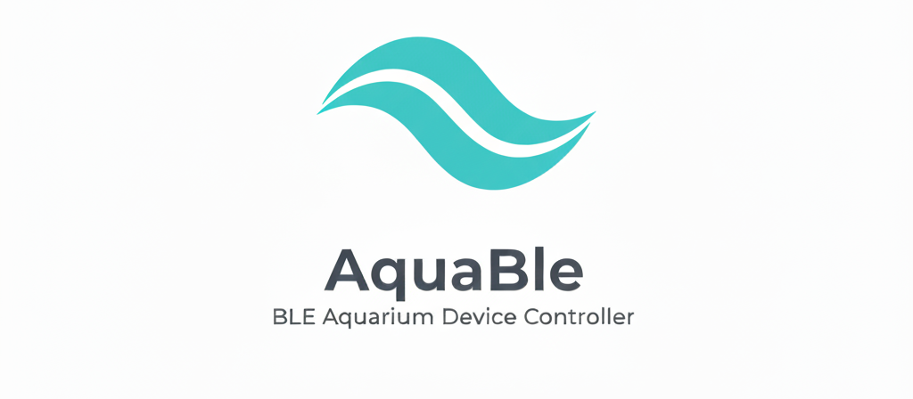

# AquaBle Home Assistant Add-on Repository



[](https://opensource.org/licenses/MIT) [](https://www.python.org/) [](https://fastapi.tiangolo.com/)

This repository contains Home Assistant add-ons for AquaBle, a lightweight network service to discover and control Chihiros aquarium lights and dosing pumps over Bluetooth Low Energy.

Add-on documentation: <https://developers.home-assistant.io/docs/add-ons>

[](https://my.home-assistant.io/redirect/supervisor_add_addon_repository/?repository_url=https%3A%2F%2Fgithub.com%2Fcaleb-venner%2Faquable)

## Add-ons

This repository contains the following add-ons:

### [AquaBle](./aquable)

![Supports aarch64 Architecture][aarch64-shield]
![Supports amd64 Architecture][amd64-shield]
![Supports armhf Architecture][armhf-shield]
![Supports armv7 Architecture][armv7-shield]

_Control Chihiros aquarium lights and dosing pumps over Bluetooth Low Energy._

[aarch64-shield]: https://img.shields.io/badge/aarch64-yes-green.svg
[amd64-shield]: https://img.shields.io/badge/amd64-yes-green.svg
[armhf-shield]: https://img.shields.io/badge/armhf-yes-green.svg
[armv7-shield]: https://img.shields.io/badge/armv7-yes-green.svg

## Legal Disclaimer

**This project is not affiliated with, endorsed by, or approved by Chihiros Aquatic Studio or Shanghai Ogino Biotechnology Co.,Ltd.** This is an independent, open-source software project developed through reverse engineering and community contributions.

- We do not reproduce, distribute, or claim ownership of any proprietary Chihiros software code
- Device compatibility is based on publicly available Bluetooth Low Energy protocol analysis
- Use of this software with Chihiros devices is at your own risk
- "Chihiros" is a trademark of Chihiros Aquatic Studio (Shanghai Ogino Biotechnology Co.,Ltd) and is used here solely for device identification purposes
- This software is provided "as-is" without warranty of any kind

## Installation

1. Add this repository to your Home Assistant Supervisor:
   - Go to **Supervisor** → **Add-on Store** → **⋮** (top right) → **Repositories**
   - Add: `https://github.com/caleb-venner/aquable`

2. Install the **AquaBle** add-on from the store

3. Configure options if needed (auto-discover, timezone, etc.)

4. Start the add-on and access the web interface

See the [AquaBle add-on documentation](./aquable) for complete details.

## Development

For development and testing of this add-on or contributing to AquaBle:

```bash
# Clone the repository
git clone https://github.com/caleb-venner/aquable.git
cd aquable

# Set up Python environment
python -m venv venv
source venv/bin/activate  # On Windows: venv\Scripts\activate
pip install -e .

# Run backend service
make dev-back

# In another terminal, run frontend
make dev-front
```

See the main project documentation in the repository for more details on development workflows, API documentation, and contributing guidelines.

## Support

If you encounter issues or have questions:

- Check the [AquaBle add-on documentation](./aquable)
- Review the [project issues](https://github.com/caleb-venner/aquable/issues)
- Visit the [Home Assistant Community Forums](https://community.home-assistant.io/)

## License

MIT License - see [LICENSE](LICENSE) file for details.

The current time is required for auto mode and can be set by sending the following command:

- Command ID: **90**
- Mode: **9**
- Parameters: [ **year - 2000**, **month**, **weekday**, **hour**, **minute**, **second** ]

- Weekday is 1 - 7 for Monday - Sunday

#### Reset Auto Mode Settings

The auto mode and its settings can be reset by sending the following command:

- Command ID: **90**
- Mode: **5**
- Parameters: [ **5**, **255**, **255** ]
